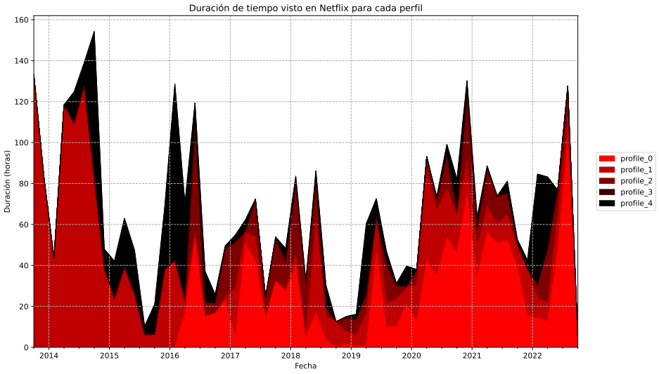
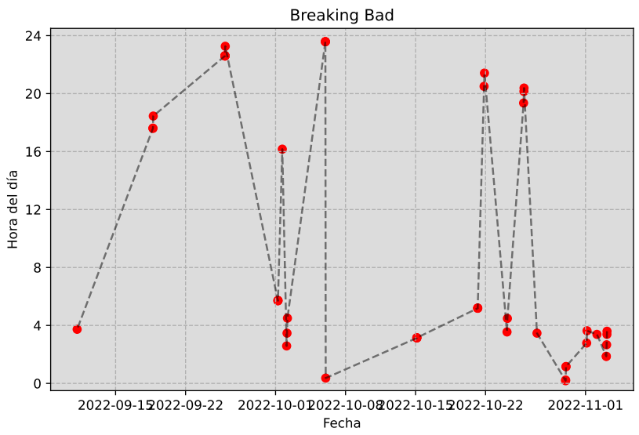
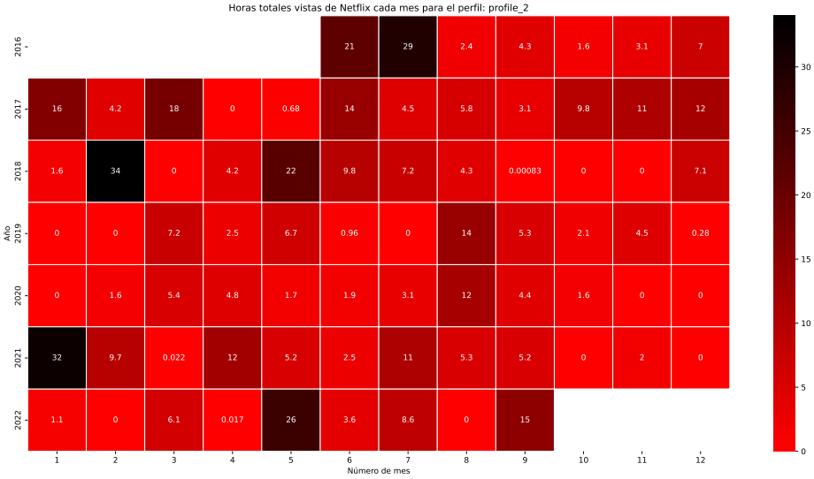

# My Netflix Data
==============================

This is a small project that does a small analysis on data provided by netflix. 

To run this project, first install the requirements on requirement.txt by using the `pip install -r requirements.txt` command.

**IMPORTANT**: I strongly recommend the use of virtual environments before installing so that to keep organized the dependencies.

The first step is to acquire the netflix information by accessing the following [link](https://www.netflix.com/account/getmyinfo). Provide the specified information and wait until the Netflix team sends you back your desired information. 
Now, you can save the zip file in the following path as follows: `data/raw/netflix-report.zip`.

Once this is done, we can finally extract the information and generate the report. To do this you can easily run
the _pipeline_flow.py_ file: `python pipeline_flow.py`

If you want to see the step-by-step execution, refer to that file as well.

This small proyect will allow you to make the following netflix analysis:

###  Duration on netfilx:
Profile seggregated duration on netflix over time.

---

### Series representation:
A tv-series represented as a time series to see when and at what hour each chapter was seen.

---

### Hour time heatmap:
Heatmap that is a calendar-like plot to see which months over the course of the profile generation have been the ones the more time was spent.

---

## Project Organization
------------

    ├── LICENSE
    ├── Makefile           <- Makefile with commands like `make data` or `make train`
    ├── README.md          <- The top-level README for developers using this project.
    ├── data
    │   ├── external       <- Data from third party sources.
    │   ├── interim        <- Intermediate data that has been transformed.
    │   ├── processed      <- The final, canonical data sets for modeling.
    │   └── raw            <- The original, immutable data dump.
    │
    ├── docs               <- A default Sphinx project; see sphinx-doc.org for details
    │
    ├── notebooks          <- Jupyter notebooks. 
    │
    ├── references         <- Data dictionaries, manuals, and all other explanatory materials.
    │
    ├── reports            <- Generated analysis as HTML, PDF, LaTeX, etc.
    │   └── figures        <- Generated graphics and figures to be used in reporting
    │
    ├── requirements.txt   <- The requirements file for reproducing the analysis environment, e.g.
    │                         generated with `pip freeze > requirements.txt`
    │
    ├── setup.py           <- makes project pip installable (pip install -e .) so src can be imported
    ├── pipeline_flow.py   <- Runs most important files to execute the report successfully. 
    ├── src                <- Source code for use in this project.
    │   ├── __init__.py    <- Makes src a Python module
    │   │
    │   ├── data           <- Scripts to download or generate data
    │   │   ├── initial_data_unzip_extraction.py
    │   │   ├── fetch_information.py
    │   │   └── movies_and_series.py
    │   │ 
    │   └── visualization  <- Scripts to create exploratory and results oriented visualizations
    │   │   ├── create_visualizations.py
    │   │   └── utils.py    
    │
    └── tox.ini            <- tox file with settings for running tox; see tox.readthedocs.io

--------

<small>Project based on the <a target="_blank" href="https://drivendata.github.io/cookiecutter-data-science/">cookiecutter data science project template</a>. #cookiecutterdatascience</small>

